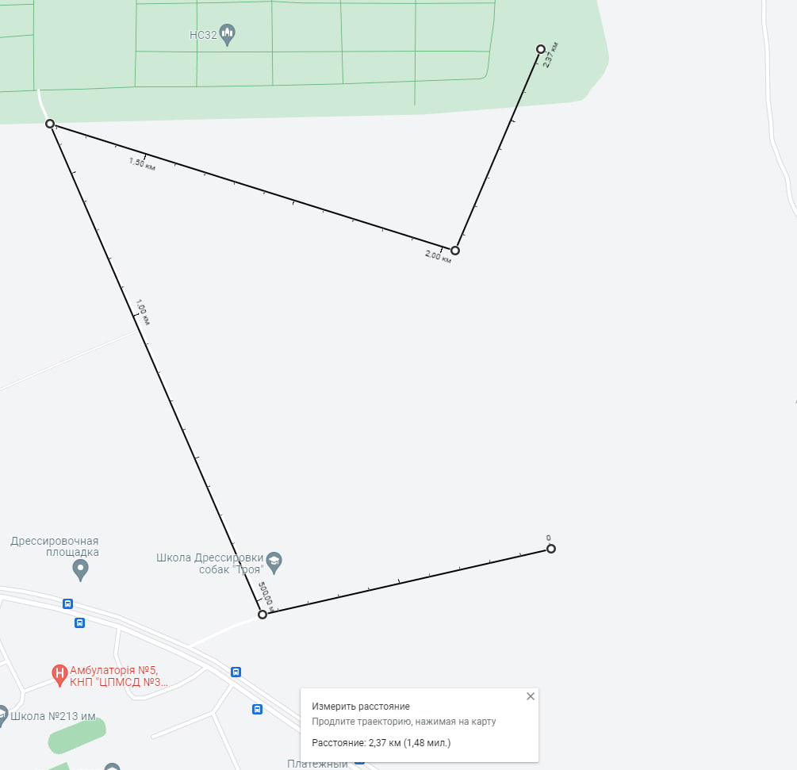
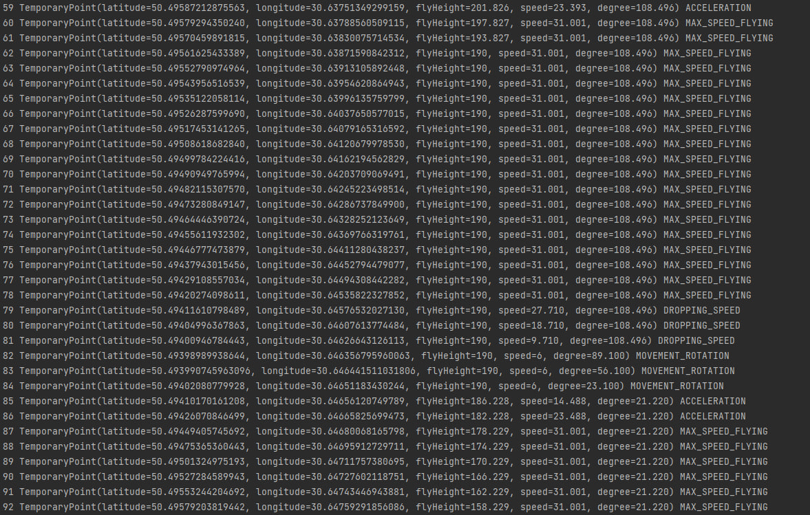

# Calculator for drones location :rocket:

This is a project that used MongoDB + Spring Boot 2 + Java 17 + Maven configuration. It allows to get temporaryPoints from every second of flying between WayPoints that can be setted.

---

## Tools used in a project:

- #### Java 17;
- #### Spring Boot;
- #### MongoDB;
- #### Maven;

---

## Project Structure 📁

DroneLocation follows a standard project structure for Spring-based applications using MongoDB. Here is overview of the structure:

- `java`: This directory contains all the Java code of the application.

    - `application`:  Main package.

    - `data`: Hold a class that set the values that need to calculate.

    - `repository`: Interfaces that provide work with database.

    - `strategy`: Strategy classes that handle the temporaryPoint calculations.

    - `model`: Entity classes used in the application.

    - `service`: Service classes that provide business logic.

- `resources`: This directory contains the `application.properties` file, that has the database configuration.

---

### To run and test application you need:

1. Install MongoDB

2. Run MongoDB

3. Run project locally. Verify everything works well.

4. You can change data in [TestData.class](src/main/java/application/data/TestData.java) to get exact location of your artifact in earth surface and set different waypoints.

WARNING 🔴 it may give you uncorrected latitude and longitude if you pass invalid value!!! Please set the value from Google Maps to check it.

---

The way that used in example:

Example of coordinates log (or check MongoDB after run the project):

