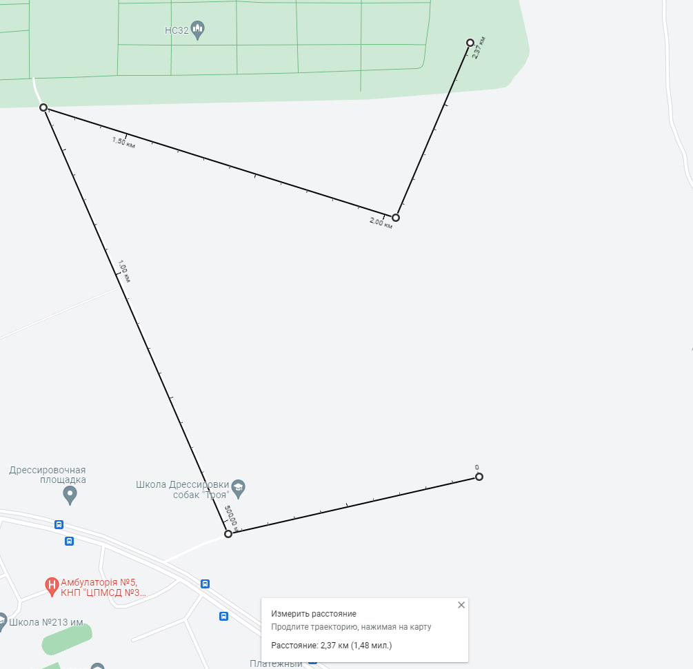

# Calculator for drones location

---

## Tools:

- #### Java 17;
- #### Spring Boot;
- #### MongoDB;
- #### Maven;

### To run and test application you need:

1. Install MongoDB

2. Run MongoDB

3. Run project locally. Verify everything works well.

4. You can change data in [TestData.class](src/main/java/application/data/TestData.java) to get exact location of your artifact in earth surface and set different waypoints.

WARNING 🔴 it may give you uncorrected latitude and longitude if you pass invalid value!!! Please set the value from Google Maps to check it.

The way that used here:

Example of coordinates log (or check MongoDB after run the project):

